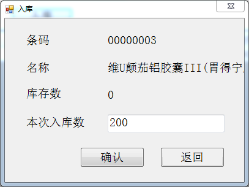

### Web端

- 症状管理
    - 新建症状时，症状描述为空时，产生系统异常错误
    - 药品类别，当药品分类很多时，显示不完全，也无法滑动显示(症状界面同样)

    

### PC端
- 入库显示名称被遮挡

- 库存丢失，无法重现
- 换货入库产生新订单，订单打印界面没有提示
- 换货入库界面显示仍然是退货原因，退货个数等。。。

### 微信端
- 收货地址不在系统配送范围内，只能预约配送
    - 第一次创建范围地址，提交订单后
    - 第二个订单创建非范围地址并选择，还是可以立即配送
    - 再次提交则正常
- 修改非默认配送地址显示请求失败
- 两个手机都在同一个商品界面，一部手机提交订单，另一部未刷新提交，还是可以超库存提交订单
- 购物车结算，显示请求页面超时
- 小儿感冒宁合计12.8*3 显示38.400000000000006元
- 分类界面无法下拉，部分分类无法显示

### APP端

- #### Android

- #### iOS
