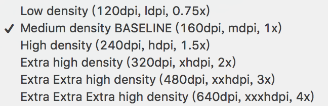
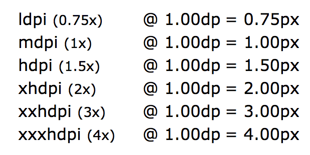
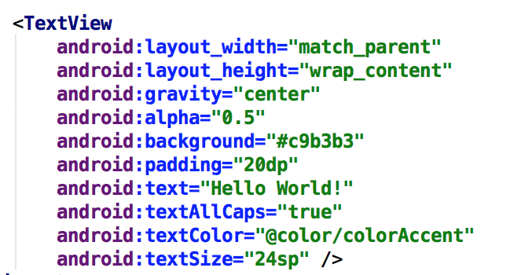
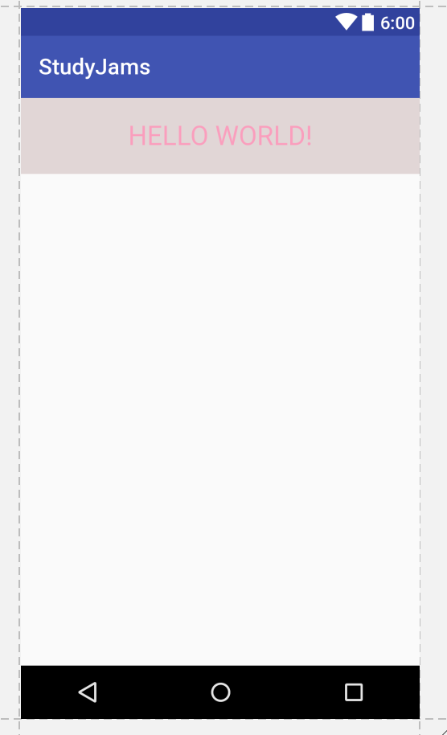
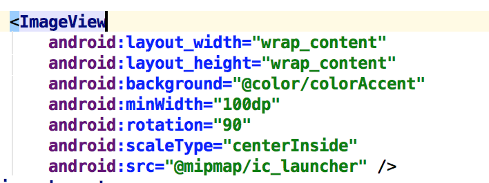
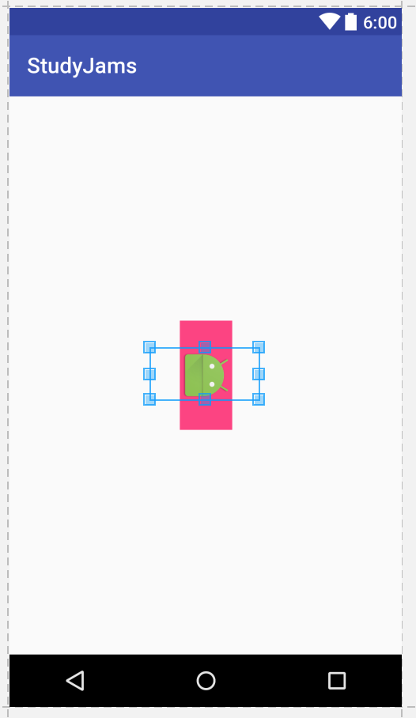

## 课程介绍
本课程共计4-5周时间，时长25h左右。
给予零基础的学员Android开发的启蒙和兴趣。

## 开发推荐
- 开发工具：Android Studio
- 设计标准：Material Design

## View的作用与类型

View作为布局Layout的基础，Layout由View构成。
最基本的View有：

- 用于文字显示的TextView
- 用于图片显示的ImageView
- 用于点击操作的Button（TextView和ImageView通过添加onClickListener也可以实现Button的效果）

Android的变量命名规范推荐使用驼峰法，例如：

- 类名等使用大驼峰法，如MainActivity，LogUtils等
- 变量名使用小驼峰法，如homeAdapter，tvName等
- 建议
    - 成员变量前加m(member)，如mWidth,mHeight等
    - 静态变量前加s(static)，如sSingleInstance等

## xml使用
页面布局文件使用xml标记语言，所有标签必须闭合。

```
<?xml version="1.0" encoding="utf-8"?>
<LinearLayout
    xmlns:android="http://schemas.android.com/apk/res/android"
    android:layout_width="match_parent"
    android:layout_height="match_parent">

    <TextView
        android:layout_width="wrap_content"
        android:layout_height="wrap_content"
        android:text="Hello World!" />
</LinearLayout>
``` 
## 屏幕适配

为了多屏幕适配，Android提供了一个虚拟像素单位dp。
px和dp的换算关系是`px = dp * (dpi / 160)`

常见屏幕密度之间对应关系如下：



## TextView试验


## ImageView实验




