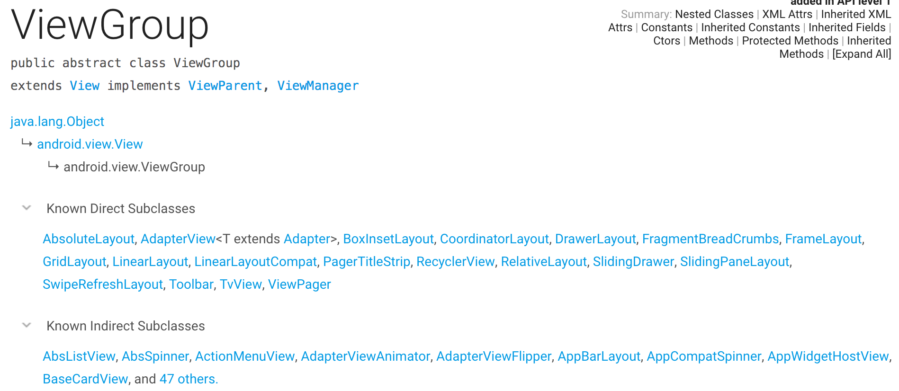
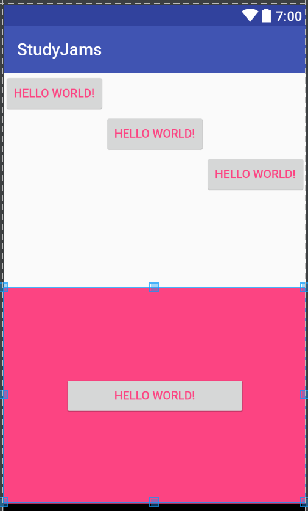
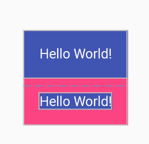
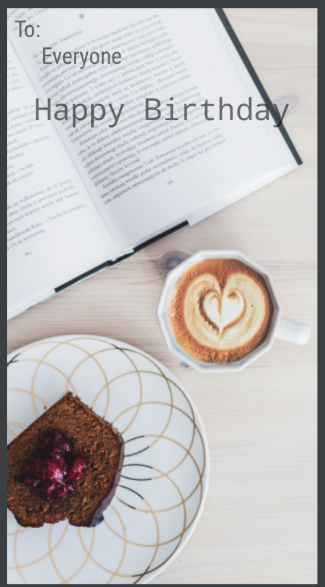

### 1B 
#### ViewGroups 介绍
- ViewGroup也是View的一种，因为它继承于View，所以同样具有宽高，背景等属性
- 此外，ViewGroup也是其他View的容器（如下图），常见的LinearLayout,RelativeLayout等都是继承于ViewGroup



#### 认识线性布局
- 常用属性
    - orientation: vertical(纵向) horizontal(横向)
    - gravity: 子View的位置
    - 其子View可以通过使用layout_weight以比例占用父View空间
    - 特殊属性：weightSum 子view占比分母，可以形成居中的效果（如下例）

    
```
<?xml version="1.0" encoding="utf-8"?>
<LinearLayout xmlns:android="http://schemas.android.com/apk/res/android"
              android:layout_width="match_parent"
              android:layout_height="match_parent"
              android:gravity="center"
              android:orientation="vertical">

    <LinearLayout
        android:layout_width="match_parent"
        android:layout_height="0dp"
        android:layout_weight="1"
        android:orientation="vertical">

        <Button
            android:layout_width="wrap_content"
            android:layout_height="wrap_content"
            android:layout_gravity="start"
            android:text="Hello World!"
            android:textColor="@color/colorAccent"/>

        <Button
            android:layout_width="wrap_content"
            android:layout_height="wrap_content"
            android:layout_gravity="center"
            android:text="Hello World!"
            android:textColor="@color/colorAccent"/>

        <Button
            android:layout_width="wrap_content"
            android:layout_height="wrap_content"
            android:layout_gravity="end"
            android:text="Hello World!"
            android:textColor="@color/colorAccent"/>
    </LinearLayout>

    <LinearLayout
        android:layout_width="match_parent"
        android:layout_height="0dp"
        android:layout_weight="1"
        android:gravity="center"
        android:background="@color/colorAccent"
        android:orientation="horizontal"
        android:weightSum="5">

        <Button
            android:layout_width="0dp"
            android:layout_height="wrap_content"
            android:layout_weight="3"
            android:text="Hello World!"
            android:textColor="@color/colorAccent"/>

    </LinearLayout>
</LinearLayout>
```

Preview:


#### 相对布局 RelativeLayout
- 简单布局适合使用`LinearLayout`，复杂布局则适合使用`RelativeLayout`以减少嵌套，防止渲染过度
- 可以使用`android:layout_alignParent*`,`android:layout_align*`(* 代表Top,Bottom,Start,End)等属性来控制子控件的位置
#### 内外边距
- padding是内边距，是内容距离边缘的距离
- margin是外边距，是边缘与其他控件或者父控件的距离

```
        <TextView
            android:layout_width="wrap_content"
            android:layout_height="wrap_content"
            android:background="@color/colorPrimary"
            android:padding="16dp"
            android:text="Hello World!"
            android:textColor="@android:color/white"/>

        <TextView
            android:layout_width="wrap_content"
            android:layout_height="wrap_content"
            android:layout_margin="16dp"
            android:background="@color/colorPrimary"
            android:gravity="center"
            android:text="Hello World!"
            android:textColor="@android:color/white"/>
```

Preview:


### 生日贺卡

##### Talk is cheap. Show me the code

```
<?xml version="1.0" encoding="utf-8"?>
<RelativeLayout xmlns:android="http://schemas.android.com/apk/res/android"
                android:layout_width="match_parent"
                android:layout_height="match_parent"
                android:gravity="center"
                android:orientation="vertical">

    <ImageView
        android:layout_width="match_parent"
        android:layout_height="match_parent"
        android:scaleType="fitXY"
        android:src="@mipmap/back"/>

    <android.support.v7.widget.AppCompatTextView
        android:layout_width="match_parent"
        android:layout_height="wrap_content"
        android:padding="8dp"
        android:fontFamily="sans-serif-condensed"
        android:text="To:\n     Everyone"
        android:textSize="24sp"/>

    <android.support.v7.widget.AppCompatTextView
        android:layout_width="wrap_content"
        android:layout_height="wrap_content"
        android:fontFamily="monospace"
        android:layout_centerHorizontal="true"
        android:layout_marginTop="80dp"
        android:padding="8dp"
        android:text="Happy Birthday"
        android:textSize="32sp"/>

</RelativeLayout>
```

Preview:




