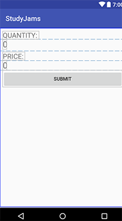
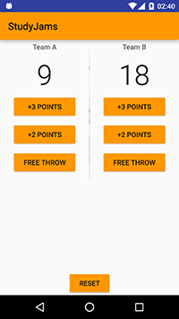

### 2A 可交互的应用-上(本节理论较少，多实践，以代码记录)

###### 未使用变量前



```java
    private void initView() {
        mQuantity = (TextView) findViewById(R.id.quantity);
        mPrice = (TextView) findViewById(R.id.price);
        Button submit = (Button) findViewById(R.id.submit);
        submit.setOnClickListener(new View.OnClickListener() {
            @Override
            public void onClick(View v) {
                displayNumber(2);
                displayPrice(2 * 5);
            }
        });
    }

    private void displayNumber(int number) {
        mQuantity.setText(number + "");
    }

    private void displayPrice(int price) {
        mPrice.setText(NumberFormat.getCurrencyInstance().format(price));
    }
```

###### 使用变量后

```java
    private void initView() {
        mQuantity = (TextView) findViewById(R.id.quantity);
        mPrice = (TextView) findViewById(R.id.price);
        Button submit = (Button) findViewById(R.id.submit);
        submit.setOnClickListener(new View.OnClickListener() {
            @Override
            public void onClick(View v) {
                int numberOfCoffees = 2; 
                displayNumber(numberOfCoffees);
                displayPrice(numberOfCoffees * 5);
            }
        });
    }
```

###### 使用全局变量后

```java
 	private TextView mQuantity;
    private TextView mPrice;
    private int quantity = 0;

    ...

    private void initView() {
        mQuantity = (TextView) findViewById(R.id.quantity);
        mPrice = (TextView) findViewById(R.id.price);
        Button submit = (Button) findViewById(R.id.submit);
        Button add = (Button) findViewById(R.id.add);
        Button sub = (Button) findViewById(R.id.sub);
        submit.setOnClickListener(new View.OnClickListener() {
            @Override
            public void onClick(View v) {
                displayPrice(quantity * 5);
            }
        });
        add.setOnClickListener(new View.OnClickListener() {
            @Override
            public void onClick(View v) {
                quantity += 1;
                displayNumber();
            }
        });
        sub.setOnClickListener(new View.OnClickListener() {
            @Override
            public void onClick(View v) {
                quantity -= 1;
                displayNumber();
            }
        });
    }

    private void displayNumber() {
        mQuantity.setText(quantity + "");
    }

    private void displayPrice(int price) {
        mPrice.setText(NumberFormat.getCurrencyInstance().format(price));
    }
```


###### 拓展

- 常见变量类型 *boolean*,*byte*,*short*,*int*,*long*, *float*, *double* 等
- 局部变量 定义在方法中或者参数形式，生命周期与方法相同
- 静态变量（全局变量）定义在类中方法外，生命周期与类相同

### 2B 可交互的应用-下

###### 使用字符串变量

```Java
    private void initView() {
		...
        submit.setOnClickListener(new View.OnClickListener() {
            @Override
            public void onClick(View v) {
                int price = quantity * 5;
                String message = "Total $" + price +"\nThank You";
                displayPrice(message);
            }
        });
        ...
    }

    private void displayNumber() {
        mQuantity.setText(quantity + "");
    }

    private void displayPrice(String message) {
        mPrice.setText(message);
    }
```

Tips: 

-  字符串的拼接可通过+号或者StringBuilders
-  转义字符（通过\加数字表示ASCII码），比如\n就是用作换行

### 2C 记分APP实现



##### 基本要点

- 根布局为RelativeLayout,Reset 按钮居于底部，上方为包含两个LinearLayout的LinearLayout,通过1dp的View分割，每个子LinearLayout包含一个TextView队名，TextView记分，三个按钮对记分递加
- 需要设置两个全局变量score_a和score_b存储各队积分
- 按钮的点击事件可以通过xml添加onClick属性对应方法，也可以设置onClickListener(推荐)

本章多实践，理论不多，都是基础，浅显易懂，所以笔记为代码和结果为主